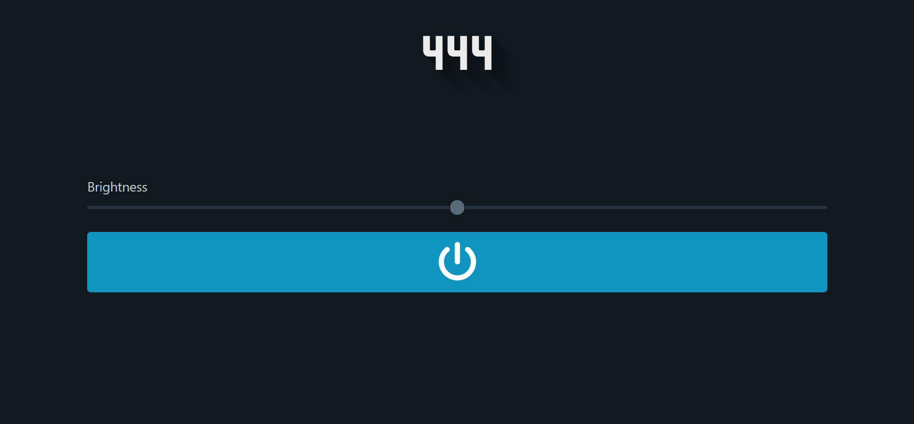
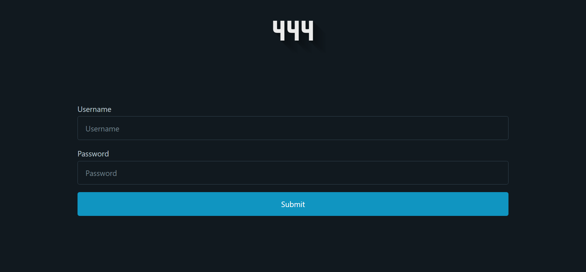
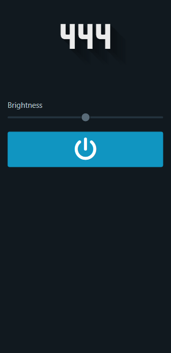
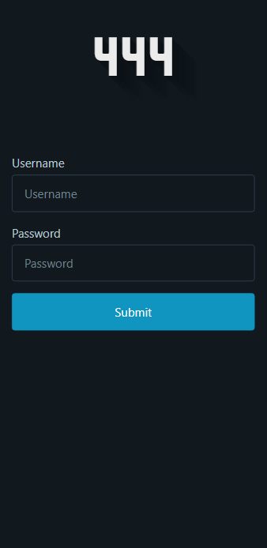

# Twin Lamps

Open-source project inspired by the idea of "Long Distance Lamp" (e.g. [Friendship Lamps](https://www.friendlamps.com/)).  
This makes two (or even more) bulbs blink at the same time using [MQTT](https://mqtt.org/). Bulbs can be on different networks, they just have to be connected to the same MQTT broker.


## What do you need?

You only need at least two [Shelly](https://shelly.cloud/) bulbs. You don't need any soldering skills as the Shelly web-panel already provides a good interface for MQTT configuration.  
You also need a MQTT broker to make the bulbs and the server communicate. I already configured [Mosquitto](https://mosquitto.org/) for docker in this guide but you can also use [other solutions](https://mqtt.org/software/) (even cloud brokers).

## How does it work?

The bulbs connect to the MQTT broker and subscribe to their topics. Also the server connects to the MQTT broker and publish on those topics.  
The server also provides a web-interface to login and make the lamp blink at different light intensities.

## Configuration .env

```dosini
WEBSITENAME=Website name
HOST=Website url
PORT=Internal port of the web-interface
DOCKERPORT=External port of the web-interface (e.g. 8080)
LAMPS=Device ID list comma separated (e.g. xxxxx,xxxxx)
LAMPSTYPE=Shelly bulb type list comma separated (e.g. ShellyVintage,ShellyBulbDuo)
MQTT_HOST=MQTT broker address (e.g. test.mosquitto.org)
USERN=MQTT broker username (also used for the web-interface)
PASSWORD=MQTT broker password (also used for the web-interface)
```

## How to use it?

Create a `.env` file as described above then do the following commands:

```bash
# Install typescript
npm install -g typescript
# Install dependencies
npm install --include=dev
# Run the server
npm run start
```

Now navigate to the web-interface on `localhost:3000` (or the port in .env file) and login.

## How to dockerize it?

You can use the `Dockerfile` to create a docker image or you can use [davegabe/twin-lamps](https://hub.docker.com/repository/docker/davegabe/twin-lamps).  
You can directly use the `docker-compose.yml` file in the root of the repository, it's configured to run `davegabe/twin-lamps`, the MQTT broker `eclipse-mosquitto` and use HTTPS protcol (by [traefik](https://traefik.io/traefik/) configuration).  
Mosquitto needs to be configured to allow authentication. Use the following command:

```bash
mosquitto_passwd -c mosquitto/config/mosquitto.passwd <username>
```

Now you're ready to run the docker image:

```bash
docker-compose --env-file .env up -d
```

## TODO:

- Add option to change duration of blink
- Add option to set permanent status on/off
- Add label count connected device or warning if not all devices are connected
- Better authentication system for multiple users
- Websocket to sync the lamp status on the web-interface
- Multi-stage docker image

## Screenshots

Here are some screenshots of the web-interface:

### Example view on desktop




### Example view on mobile



